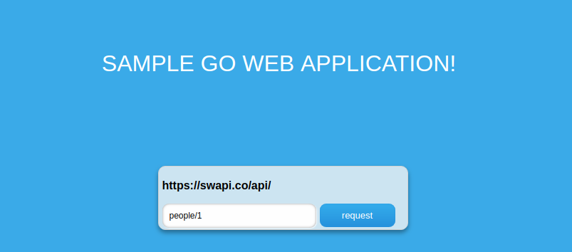
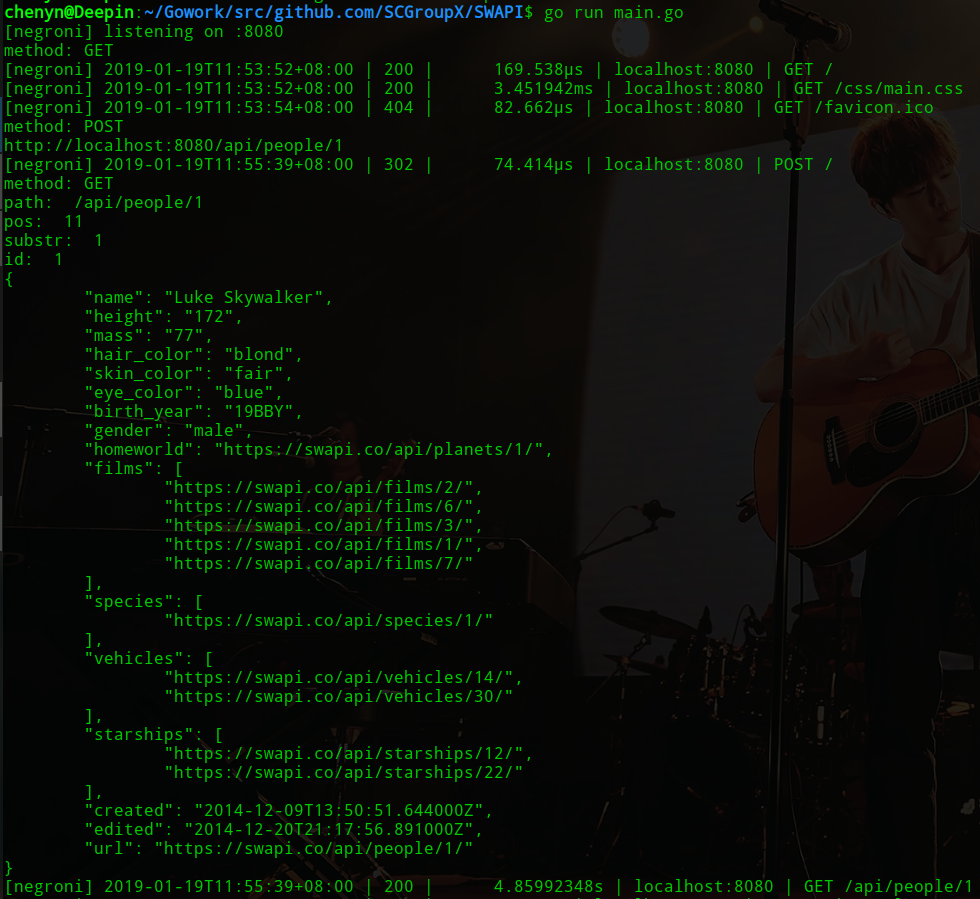

# SWAPI 项目文档

## Usage:

- 前端：使用JavaScript语言编写；
- 后端：使用Go语言实现，运行在localhost:8080，使用命令`go get github.com/SCGroupX/SWAPI/service`安装；

## Description:

本项目模仿`https://swapi.co/`实现SWAPI相关的功能，添加了资源的授权访问部分的内容。

- 数据来源：

  资源数据均抓取于源网站 `https://swapi.co/`；

- 资源类型：

  `films`、`people`、`planets`、`species`、`starships`、`vehicles`；

- 授权访问采用 jwt 验证；

- 服务API：

  - `films`资源 
    - `/api/films/{id} GET `
  - `people`资源 
    - `/api/people/{id} GET `
  - `planets`资源 
    - `/api/planets/{id} GET `
  - `species`资源 
    - `/api/species/{id} GET `
  - `starships`资源 
    - `api/starships/{id} GET`
  - `vehicles`资源
    - `api/vehicles/{id} GET`

## Test:

我们以`https://swapi.co/api/people/1`为例进行测试：

服务端显示如下：

测试成功。

 